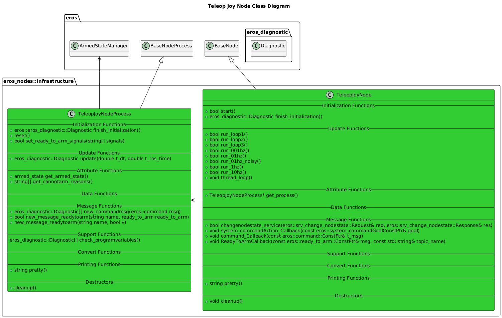
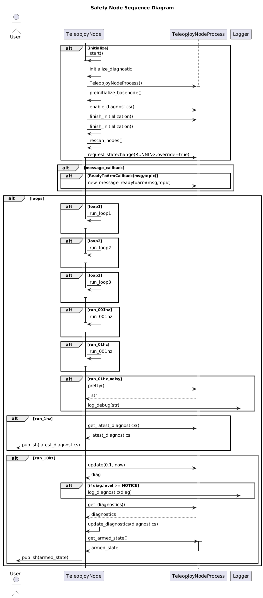

# Teleop Joy Node

## Overview
The Teleop Joy Node provides thecapability to consume a Joystick Message from ROS and convert to the necessary Drive Controls.


## Features

## Configuration

#### Topics of type eros/ready_to_arm

## Software Design


### Class Diagrams



### Sequence Diagrams


## Troubleshooting
```bash
sudo apt install qjoypad
qjoypad --notray # Then click on Joypad image that opens
```

## Future Features

# References
- [Game Controller Manual](ref/EasySMX%20X15%20manual.pdf)
- https://wiki.ros.org/joy
- https://wiki.ros.org/joy/Tutorials/ConfiguringALinuxJoystick
