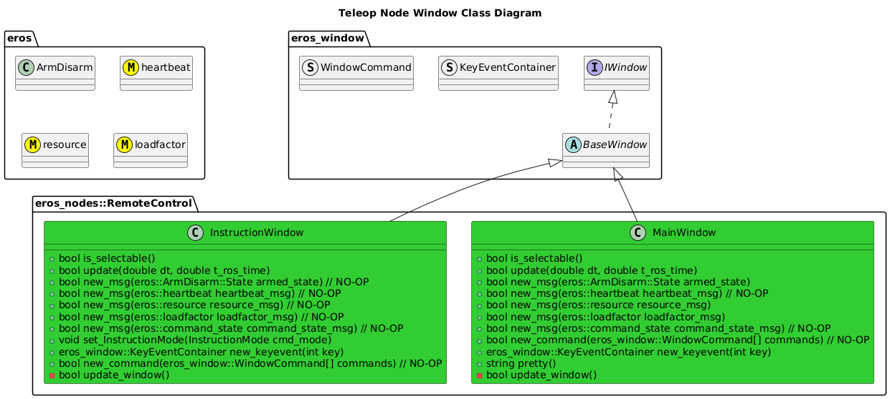
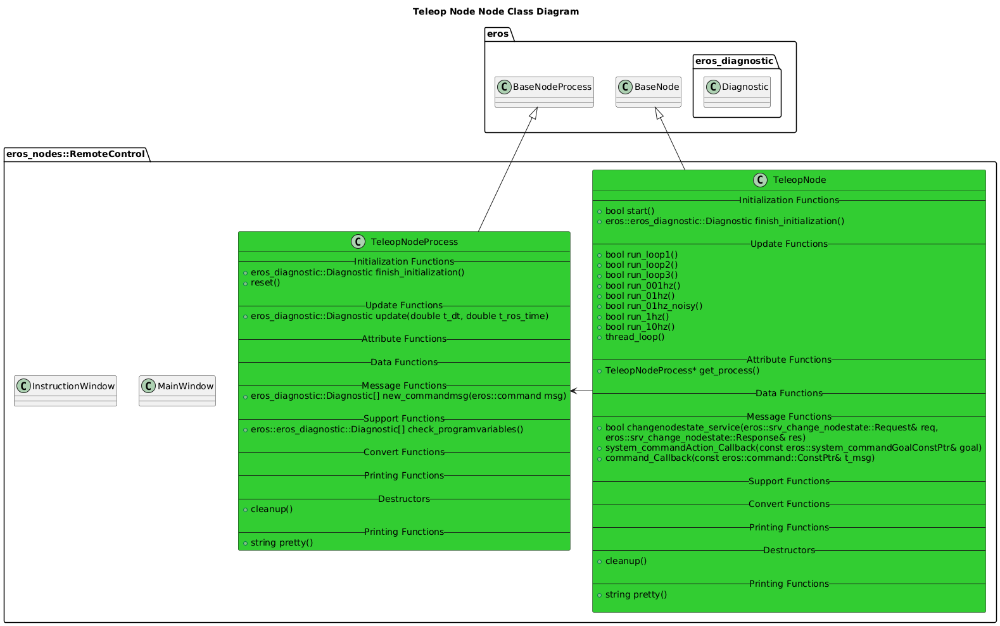
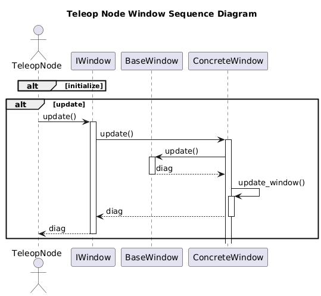
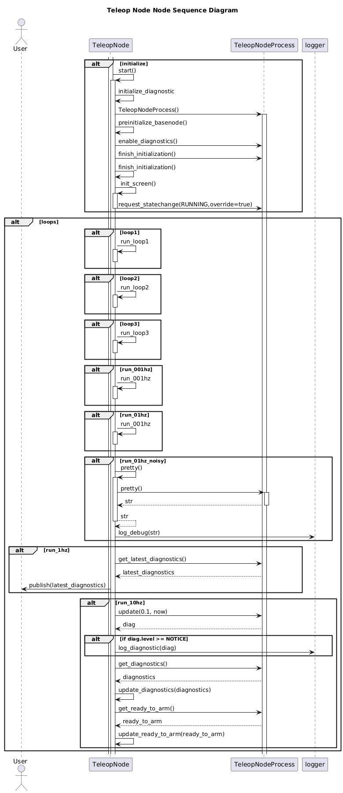

# Teleop Node
For more information on the Teleop Node, see [Teleop GUI Feature](../../../../doc/Features/TeleopGUI/TeleopGUI.md).


## Usage Instructions:
After building the eros application, simply run:
```
rosrun eros teleop_gui 
```

## Configuration
There is no configuration required for typical usage of the Teleop GUI.


## Software Design


### Class Diagrams




### Sequence Diagrams



## Troubleshooting